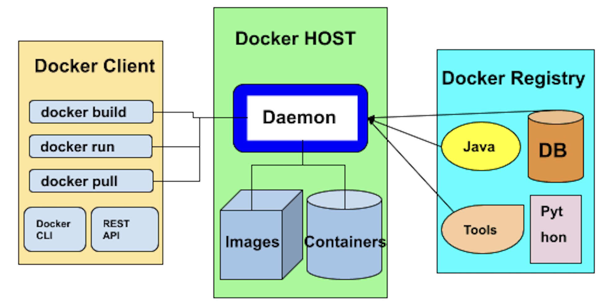

## **1: Introduction to Containerization and Docker**

### **1. What is Containerization?**

- **Definition:**
  - Containerization is a lightweight alternative to full machine virtualization that involves encapsulating an application in a container with its own operating environment.
- **Purpose:**
  - Ensure that an application runs reliably when moved from one computing environment to another.
- **Benefits:**
  - **Portability:** Containers bundle the application with all its dependencies.
  - **Efficiency:** Share the host system's kernel, leading to lower overhead compared to virtual machines.
  - **Isolation:** Processes inside a container are isolated from the host system and other containers.

### **2. The Evolution of Application Deployment**

#### **Comparison Between Virtual Machines and Containers**

| **Aspect**             | **Virtual Machines (VMs)**                                         | **Containers**                                             |
|------------------------|---------------------------------------------------------------------|------------------------------------------------------------|
| **Architecture**       | Includes the entire guest operating system                          | Shares the host operating system kernel                     |
| **Resource Usage**     | Heavy; each VM requires significant system resources                | Lightweight; uses fewer resources due to shared kernel      |
| **Startup Time**       | Slow; can take minutes to boot                                      | Fast; typically starts in seconds                           |
| **Isolation**          | Strong isolation via hypervisor                                     | Process-level isolation using namespaces and cgroups        |
| **Portability**        | Less portable; tied to specific hardware and hypervisor requirements | Highly portable across different environments               |
| **Performance**        | Overhead due to full OS virtualization                              | Near-native performance                                     |
| **Storage**            | Requires substantial disk space for each OS image                   | Smaller footprint; images are layered and shared            |
| **Use Cases**          | Running multiple OS types, legacy applications                      | Microservices, scalable applications, continuous deployment |
| **Management**         | Complex management and orchestration                                | Simplified management with tools like Docker Compose        |
| **Networking**         | Separate virtual network interfaces                                 | Shares host networking or uses virtual networks             |


### **3. Introduction to Docker**

- **What is Docker?**
  - An open-source platform designed to automate the deployment, scaling, and management of applications using containerization.
- **History:**
  - Released in 2013 by Docker, Inc.
- **Key Components:**
  - **Docker Engine:** Core of Docker, a client-server application.
  - **Docker Images:** Read-only templates used to create containers.
  - **Docker Containers:** Instances of Docker images that can be run.
  - **Docker Hub:** A registry of Docker images (both official and user-contributed).

---

## **2: Docker Architecture and Key Concepts**

### **1. Docker Architecture Overview**

- **Docker Client:**
  - The interface users interact with (CLI commands).
- **Docker Daemon (Server):**
  - Runs on the host machine.
  - Listens for Docker API requests and manages Docker objects.
- **Docker Registry:**
  - Stores Docker images.
  - **Docker Hub** is the default public registry.



### **2. Docker Images**

- **Definition:**
  - Read-only templates with instructions for creating a Docker container.
- **Layers:**
  - Built in layers; each layer represents an instruction in the image’s Dockerfile.
  - Layers are cached and shared among images, saving space and speeding up builds.
- **Creating Images:**
  - **Dockerfile:** A script containing instructions to build an image.
  - **Commands:** `FROM`, `RUN`, `CMD`, `COPY`, `ADD`, `EXPOSE`, `ENV`, etc.


### **3. Docker Containers**

- **Definition:**
  - A runnable instance of an image.
- **Lifecycle:**
  - **Create:** `docker create`
  - **Start:** `docker start`
  - **Run:** `docker run` (creates and starts)
  - **Stop:** `docker stop`
  - **Remove:** `docker rm`
- **Isolation:**
  - Uses OS-level virtualization provided by the host OS (namespaces and cgroups).

### **4. Docker Networking**

- **Bridge Network:**
  - Default network driver; containers on the same bridge network can communicate.
- **Host Network:**
  - Container shares the host's networking namespace.
- **Overlay Network:**
  - Enables swarm services to communicate with each other.
- **Network Commands:**
  - List networks: `docker network ls`
  - Create network: `docker network create`
  - Connect container to network: `docker network connect`

### **5. Docker Volumes**

- **Purpose:**
  - Persist data generated and used by Docker containers.
- **Types:**
  - **Volumes:** Managed by Docker, stored in Docker host filesystem.
  - **Bind Mounts:** Map host directories or files into the container.
- **Commands:**
  - Create volume: `docker volume create`
  - List volumes: `docker volume ls`
  - Inspect volume: `docker volume inspect`

---

## **3: Working with Docker – Basic Commands and Workflow**

### **1. Installing Docker**

- **Platforms Supported:**
  - Windows, macOS, Linux.
- **Installation Methods:**
  - **Docker Desktop:** GUI application for Windows and macOS.
  - **Package Managers:** `apt`, `yum`, etc., for Linux distributions.

### **2. Pulling and Running Images**

- **Pull an Image from Docker Hub:**

  ```bash
  docker pull ubuntu:latest
  ```

- **Run a Container:**

  ```bash
  docker run ubuntu:latest
  ```

  - **Options:**
    - `-it`: Interactive mode with terminal.
    - `--name`: Assign a name to the container.
    - `-d`: Run container in detached mode.

### **3. Building Images with Dockerfile**

- **Dockerfile Example:**

  ```dockerfile
  # Use an official Python runtime as a parent image
  FROM python:3.8-slim

  # Set the working directory
  WORKDIR /app

  # Copy the current directory contents into the container
  COPY . /app

  # Install any needed packages specified in requirements.txt
  RUN pip install --no-cache-dir -r requirements.txt

  # Make port 80 available to the world outside this container
  EXPOSE 80

  # Define environment variable
  ENV NAME World

  # Run app.py when the container launches
  CMD ["python", "app.py"]
  ```

- **Build an Image:**

  ```bash
  docker build -t my-python-app .
  ```

### **4. Managing Containers**

- **List Running Containers:**

  ```bash
  docker ps
  ```

- **List All Containers (including stopped ones):**

  ```bash
  docker ps -a
  ```

- **Start and Stop Containers:**

  ```bash
  docker stop container_name
  docker start container_name
  ```

- **Remove Containers:**

  ```bash
  docker rm container_name
  ```

### **5. Container Networking**

- **Port Mapping:**

  - Map container port to host port using `-p`:

    ```bash
    docker run -p 8080:80 my-python-app
    ```

    - Host port `8080` maps to container port `80`.

- **Inspect Network Settings:**

  ```bash
  docker inspect container_name
  ```

### **6. Using Volumes for Data Persistence**

- **Create a Volume:**

  ```bash
  docker volume create my-volume
  ```

- **Run Container with Volume:**

  ```bash
  docker run -d -v my-volume:/data my-python-app
  ```

- **Bind Mount a Host Directory:**

  ```bash
  docker run -d -v /path/on/host:/data my-python-app
  ```

### **7. Docker Compose**

- **Purpose:**
  - Tool for defining and running multi-container Docker applications.
- **Compose File (`docker-compose.yml`) Example:**

  ```yaml
  version: '3'
  services:
    web:
      build: .
      ports:
        - "5000:5000"
      volumes:
        - .:/code
      depends_on:
        - redis
    redis:
      image: "redis:alpine"
  ```

- **Commands:**

  - **Start Services:**

    ```bash
    docker-compose up
    ```

  - **Stop Services:**

    ```bash
    docker-compose down
    ```

### **8. Best Practices**

- **Keep Images Small:**
  - Use lightweight base images (e.g., `alpine`).
- **Leverage Caching:**
  - Order Dockerfile instructions to maximize layer caching.
- **Environment Variables:**
  - Use `ENV` and `.env` files to manage configurations.
- **Security:**
  - Run containers with least privileges.
  - Regularly update images to include security patches.
- **Documentation:**
  - Comment your Dockerfiles.
  - Maintain README files explaining how to build and run containers.


